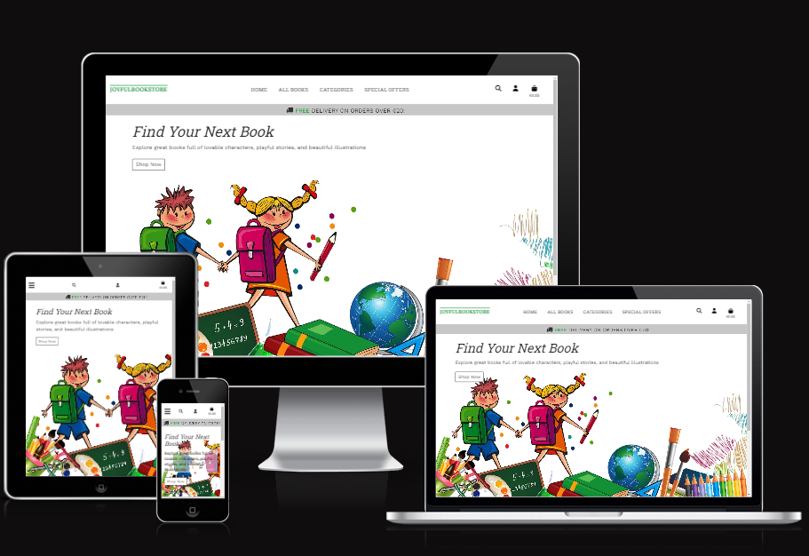

<h1 align="center">JOYFULBOOKSTORE</h1>

# Table of Contents

1. [UX](#ux)

   - [Strategy](#strategy)
   - [User Stories](#user-stories)

2. [Scope](#scope)

   - [Features](#features)
   - [Future Features](#future-features)

3. [Structure](#structure)

   - [Sitemap](#sitemap)
   - [Wireframes](#wireframes)
   - [Database schema](#database-schema)
   - [Models](#models)

4. [Web marketing](#web-marketing)

   - [Newsletter](#newsletter)
   - [Facebook](#facebook)
   - [SEO](#seo)

5. [Surface](#surface)

6. [Technologies Used](#technologies-used)

7. [Code validation](#code-validation)

8. [Testing](#testing)

9. [Bugs](#bugs)

10. [Deployment](#deployment)

11. [Credits](#credits)

responsive image and link to live site

# About

This is a full-stack e-commerce project built using Django, Python, HTML, CSS and JavaScript. I created a website for 'JoyfulBookstore' which is designed to sell children's books

# UX

## Strategy

Using the core UX principles I first started with Strategy, thinking about the target audience & the features they would benefit from.

The target audience for 'JoyfulBookstore' are:

- adults who buy books for their children. It can be parents, uncles, aunts, grandparents, teachers - anyone

These users will be looking for:

- An informative website, with information that is easy-to-find & concise
- A website that offers children's books
- Ability to view & purchase books that are for sale
- Ability to make a user account in order to see billing history, make whishlist and write reviews
- A way to sign up for the bookstore newsletter

This website will offer all of these things whilst also allowing for intuitive navigation and conformability of use.

## User Stories

**Epic: Admin/Store Owner**

| ID  | Content                                                                                                                                                   |
| --- | --------------------------------------------------------------------------------------------------------------------------------------------------------- |
| 1   | As a **store owner** I can log in/out from of the admin panel so that I can connect or disconnect from the website                                        |
| 2   | As a **store owner** I can log in so that I have full access to the store backend                                                                         |
| 3   | As a **store owner** I can add new product to the shop so that I can make sure the website is up to date                                                  |
| 4   | As a **store owner** I can add new categories to the shop so that I can make sure the website is up to date                                               |
| 5   | As a **store owner** I can add FAQ's to the site so that I can make sure that the user can find answer on the page before contacting the customer         |service                                                                                                                                                           |
| 6   | As a **store owner** I can edit/delete products so that I can make sure the website is up to date                                                         |
| 7   | As a **store owner** I can edit/delete categories so that I can make sure the website is up to date                                                       |
| 8   | As a **store owner** I can edit/delete FAQ's so that I can make sure the FAQ's are answered on correctly                                                  |
| 9   | As a **store owner** I can send out a newsletter via email so that I keep customers updated with new books                                                |
| 10  | As a **store owner** I have created Facebook shop page to increase traffic on my website                                                                  |
| 11  | As a **store owner** I can add/edit or delete questions to FAQ's section so that I can provide users with information about common questions and concerns |

**Epic: Navigation**

| ID  | Content                                                                                                                      |
| --- | ---------------------------------------------------------------------------------------------------------------------------- |
| 12  | As a **user** I can see an interesting home page so that I can understand what shop sells                                    |
| 13  | As a **user** I can easily navigate through the site so that I can view desired content                                      |
| 14  | As a **user** I can easily find a navigation bar and footer so that I can see what content there is on the website           |
| 15  | Aa a **user** I can easily see the products list so that I can see what the store has to offer                               |
| 16  | As a **user** I can sort products by category so that I can easily find what I'm looking for                                 |
| 17  | As a **user** I can sort products by rating, price and name so that I can easily find what I'm looking for                   |
| 18  | As a **user** I can search for products using the search form so that I can find the products I'm specifically looking for   |
| 19  | As a **user** I can see the book details page so that I can see the book name, rating, price, short description and comments |
| 20  | As a **user** I can read the FAQ's so that I can find the answer to my question or concern before contacting the bookstore   |

**Epic: Purchase**
| ID | Content |
| --- | ----------- |
| 21 | As a **user** I can select the quantity of the desired product so that I can buy more product of the same kind
| 22 | As a **user** I can add a selected book into the shopping bag so that I can keep track of what I am spending
| 23 | As a **user** I can see the shopping bag summary and total cost so that I can see how much I will spend
| 24 | As a **user** I can remove items from shopping bag so that I don't buy what I don't want
| 25 | As a **user** I can put in my card details so that I can pay for my goods
| 26 | As a **user** I receive order confirmations so that I can be sure my order has been processed

**Epic: User Interaction**

| ID  | Content                                                                                                                                |
| --- | -------------------------------------------------------------------------------------------------------------------------------------- |
| 27  | As a **user** I can see rating and reviews so that I can read the opinions of other users                                              |
| 28  | As a **user** I am notified about any changes I have made so that I have a clear understanding of what has been completed/updated      |
| 29  | As a **user** I can connect to the social media sites so that I can follow them and keep up to date with their products and promotions |
| 30  | As a **user** I can sign up for the website's newsletter so that I can keep up to date with new products and promotions                |
| 31  | As a **user** I can contact the bookstore so that I can find out any information that I require                                        |
| 31  | As a **user** I can receive a contact confirmation email to let me know that my email has been sent                                    |
| 32  | As a **logged-in User** I can leave reating and reviews so that I can share my experience with others                                  |
| 33  | As a **logged-in User** I can save selected products to my whishlist for later purchase                                                |

**Epic: Accounts**

| ID  | Content                                                                                                                  |
| --- | ------------------------------------------------------------------------------------------------------------------------ |
| 34  | As a **user** I can easily see if I'm logged-in or logged-out so that I can be sure what my status is                    |
| 35  | As a **user** I can log in/out off my account if I wish so that I can connect or disconnect from the website             |
| 36  | As a **user** I can register for an account so that I can use features for logged-in users                               |
| 37  | As a **user** I can receive a confirmation email when creating an account so that I know the registration was successful |
| 38  | As a **logged-in User** I can have my details saved so that I don't have to retype my address every time                 |

# Scope

## Features

### **Home Page**

_Navigation bar:_

- The navigation bar appears on every page so users can easily navigate through the site
- Navigation bar has links for 'Home', 'All Books', 'Categories' and icons for search bar, account and shopping bag

_Account - Login/Register:_

- The Login/Register feature is located in the upper right corner and offers the user to log in or register for an account as well as log out of the site
- When the user is logged in links for 'Login' and 'Register' will change to 'My Profile', 'Logout' and add Whishlist
- The admin user has extra access that allow them to add, update and remove books from the store

_Shopping bag:_

- The shopping bag is also situated on the top right corner of the site and it is always visible for the user throughout all the pages. With one click they can access their shopping bag to see what is in there, update the quantities of book they wish to purchase or to delete them from the shopping bag
- The navbar is fully responsive, collapsing into a hamburger menu for medium and small screen size

_Carousel:_

- The carousel welcomes the user with a short message and background image advertising what the website is about
- The 'Shop Now' button will take users to the all books page

_New releases:_

- The New Releases section displays the latest books that the bookstore has in store so users can keep up with new book releases
- Each book card displayes an image, book title, author and price
- Each book card will take the user to the book details page where the user can add book to the shopping bag or whishlist
- Each book card also had an "Add to Bag" button so the user could quickly add the book to their shopping bag

_Footer:_

- Appears on every page and contains FAQ's, Shipping Info, Privacy Policy, Subscribe form, Contact Link and Social links
- Social links are opened in a new tab to avoid dragging users from our site

### **User Profile**

- A logged-in user can access the My account link, this page displayed links to personal details, previous orders and wishlist
- The personal details page is where the user can update their default shipping/billing address and contact information
- The previous order displays a list of all the orders previously made by the user
- Wish list displays the list of items the user has saved to their wishlist, with the ability to remove the product

### **Admin User**

- Admin user can preform full CRUD functionalliy without having to enter the default 'admin panel' from django
- Admin user can add books from 'Book Managment' link in the account menu from the navigation bar
- Admin user can add category from 'Book Managment' link
- Admin user can add FAQ's from 'FAQ's' link
- Admin user can send Newsletter to subscribed users
- Admin user can unsubscribe user
- Admin user can edit/delete books from all books page and books details page
- Admin user can edit/delete category from 'Category Management' link
- Admin user can edit/delete FAQ from 'FAQ Managemnt' and FAQ's page, mark them as published or draft

### **All Books**

- The All Books page shows all the books that the bookstore sells
- Each book has an image, book title, author, rating and price
- Each book card takes users to the book details page

### **Categories**

- Categories dropdown from Navbar, allowing the user to access specific categories
- Categories:
  - Board Books
  - Pitcure Story Books
  - First Reads
  - Early Readers
  - Fiction Books
  - Non Fiction Books
  - Sale
  - New Arrivals

### **Special Offers**

- Special Offers dropdown from Navbar, allowing the user to access specific offer
- From the dropdown menu user can select : - Sale - New arrivals

### **Book Details Page**

- The Book Details Page displays all the information about the selected book
- Page main body of the page will display book cover image, title, rating, author, book type, size, suitable for ages, category, description
- After the main body content user can select quantity and add product to the shopping bag or whishlist
- Commenting section is located at the end of the page, only logged in users can leave a comment

### **Checkout Page**

- The checkout page is accessible through the shopping bag
- Once the site users have made their last decision about what to purchase and they are happy with it. At the checkout the site user can enter and save their personal details and see a summary of what they are about to purchase before entering their card details
- If the checkout was successful the user is taken to the 'checkout success' page, which displays the order number and delivery details

### **Shopping Bag**

- The shopping bag page provides an overview of all of the items added by the user
- The information is displayed in a table that has product name, image, quantity, price and subtotal
- The user can amend the quantity of each product and also remove it whilst on this page
- Buttons to proceed to the checkout or to keep shopping are located at the end of the page

## Future Features

- Gift Card
- School and craft materials
- Stock app

#

# Structure

In the children's book market, the target audience isn't made up of children but the bigs who purchase the books for them. That might be parents, uncles, aunts, grandparents,teachers — whomever so the structure idea for JoyfullBookstore was to keep it simple. Simplicity helps users to quickly and easily access the app and navigate within the app.

The website is made from \_\_\_ app:

- Books
- Checkout
- Home
- Newsletter
- Profiles
- Questions
- Shopping Bag
- Wishlist

# Sitemap

# Wireframes

All wireframes were created used [Balsamiq](https://balsamiq.com/)

Wireframes for each device are linked here:

- [Desktop](assets/documents/README_docs/Desktop-wireframes.pdf)
- [Mobile](assets/documents/README_docs/Mobile-wireframes.pdf)

# Database schema

- I added the category to the database later so the admin could have full CRUD functionality

# Design choice
Bootstrap provides a flexible framework for building upon and wherever possible its structure has been used and modified to achieve the desired functionality and feel.

## Color schema

The color scheme is green, because it is neutral and the page looks cheerful, the combination of white, green and gray gives the page a nice but also cheerful look

- #139035 - green color for site logo
- dimgray - footer color, fit nicely with the page
- gold - used for sale and new labels

The aim was to provide a solid colour base which could bring the other elements on the site to life.

## Fonts 
- Playfair Display - welcome message heading, modal title and navbar-brand
- Roboto Slab - nav and footer links 
- Work Sans - main font 

# Technologies Used

## Languages 
- [HTML5](https://en.wikipedia.org/wiki/HTML5)
- [CSS3](https://en.wikipedia.org/wiki/CSS)
- [Javascript](https://developer.mozilla.org/en-US/docs/Web/JavaScript)
- [Python](https://www.python.org/)

## Frameworks, Libraries & Programs Used
[GitHub](https://github.com/) - Holds the repository of my project, GitHub connects to GitPod and Heroku.

[GitPod](https://gitpod.io/workspaces) – Connected to GitHub, GitPod hosted the coding space, allowing the project to be built and then committed to the GitHub repository. 

[AWS](https://aws.amazon.com/) – was used to store our static files 

[Heroku](https://www.heroku.com/) - Connected to the GitHub repository, Heroku is a cloud application platform used to deploy this project so the backend language can be utilised/tested. 

[Django](https://www.djangoproject.com/) - This framework was used to build the foundations of this project

[Gunicorn](https://gunicorn.org/) - Gunicorn is a pure-Python HTTP server for WSGI applications.

[Dj Database URL](https://pypi.org/project/dj-database-url/) - This allows you to utilize the 12factor inspired DATABASE_URL environment variable to configure your Django application.

[Bootstrap](https://getbootstrap.com/) - Used to quickly add design to my website, Bootstrap focuses on mobile first design meaning this website is responsive across multiple devices ans screen sizes. 

[jQuery](https://jquery.com/) - Used to write JS code

[Google Fonts](https://fonts.google.com/https://fonts.google.com/) - provide fonts for the website.

[Font Awesome](https://fontawesome.com/) -was used for icons.

[Balsamiq](https://balsamiq.com/) - was used to create site wireframes.

[Am I Responsive](http://ami.responsivedesign.is/) - to check if the site is responsive on different screen sizes.

[W3C Markup Validator](https://validator.w3.org/#validate_by_input) - was used to validate HTML

[W3C CSS Validator](https://jigsaw.w3.org/css-validator/) - was used to validate CSS

## Extensions 

[Boto3](https://boto3.amazonaws.com/v1/documentation/api/latest/index.html) - was used to to create, configure, and manage AWS services

[Pillow](https://pillow.readthedocs.io/en/stable/) - This library provides extensive file format support, an efficient internal representation, and fairly powerful image processing capabilities.

[Stripe](https://stripe.com/docs) - was used to make and process payments

