# Validators

## HTML

- All Pages were checked with the official [W3C validator](https://validator.w3.org/). 

## Lighthouse 

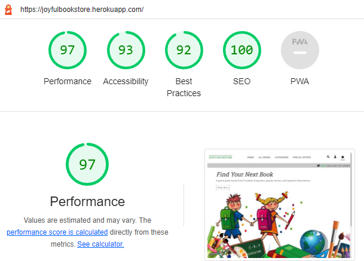

## Home Page

## All Books Page

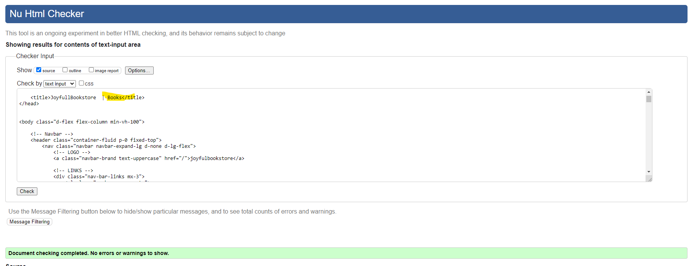

## Book Detail

## Shopping Bag

Unsolved bug! 
Due to lack of time, it remained unresolved

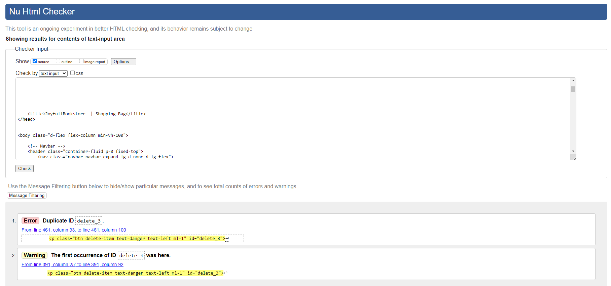

## Checkout Page

## User Account

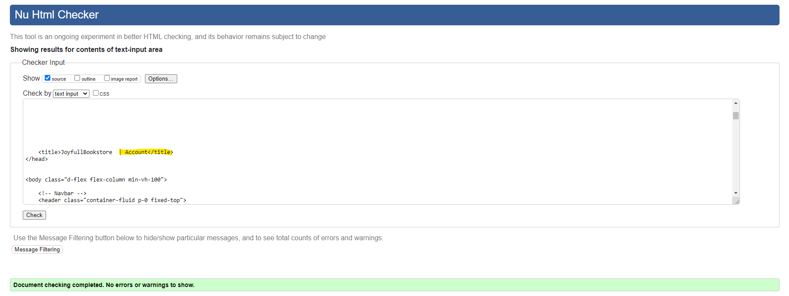

## Admin Account

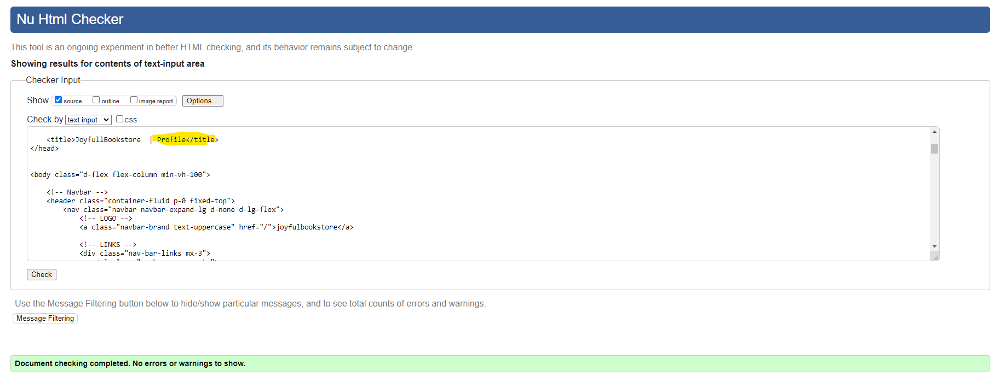

## Contact Page

# User Stories Testing

## EPIC: Admin
1. As a store owner I can log in/out from of the admin panel so that I can connect or disconnect from the website
    -  Admin can login/out from admin panel and have full accedd to store backend

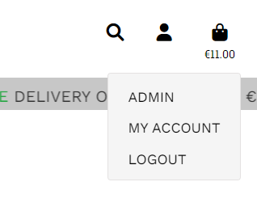

2. As a store owner I can add new product to the shop so that I can make sure the website is up to date
    - Store Owner can add products directly from Admin panel

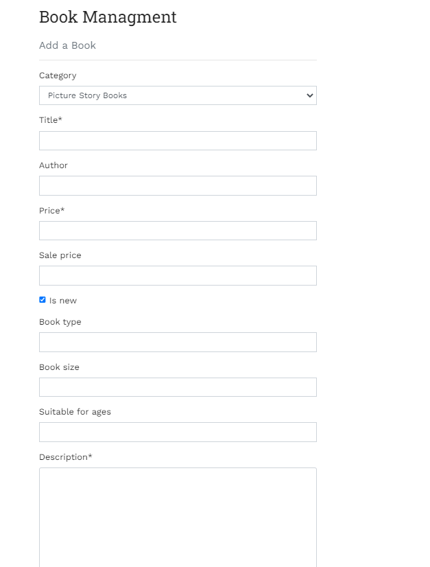

3. As a store owner I can add new categories to the shop so that I can make sure the website is up to date
    - Store Owner can add categories directly from Admin panel

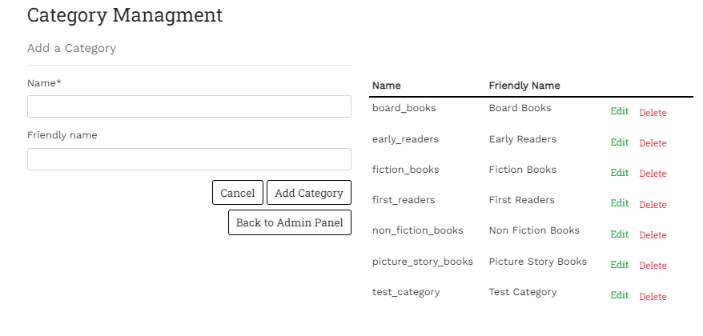

4. As a store owner I can add FAQ's to the site so that I can make sure that the user can find answer on the page before contacting the customer
    - Store Owner can add FAQ's directly from Admin panel

5. As a store owner I can edit/delete products so that I can make sure the website is up to date
    - Store Owner can edit/delete products directly from Admin panel or from All Books page and Book Detail page

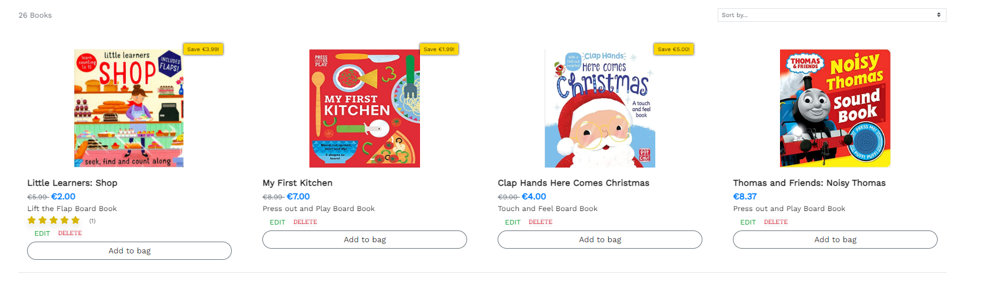

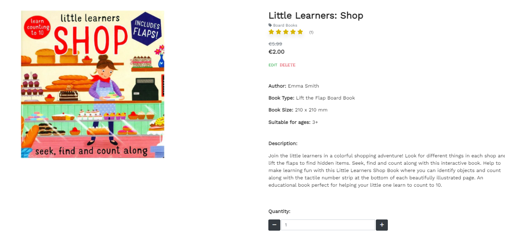

6. As a store owner I can edit/delete categories so that I can make sure the website is up to date
    - Store Owner can edit/delete categories directly from admin panel

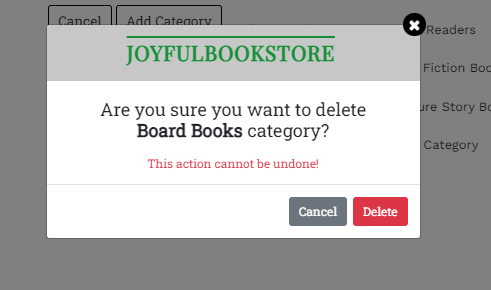

7. As a store owner I can edit/delete FAQ's so that I can make sure the FAQ's are answered on correctly
    - Store Owner can edit/delete questions directly from the FAQ's page or from admin panel

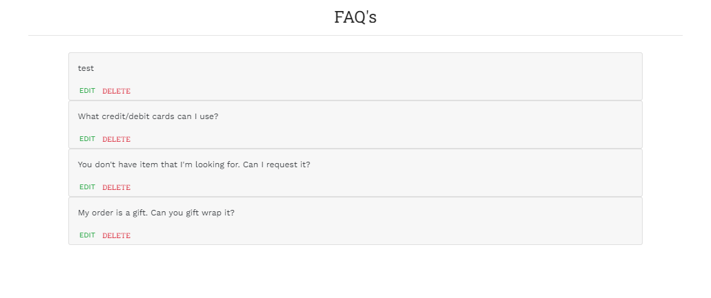

8. As a store owner I can send out a newsletter via email so that I keep customers updated with new books
    - Store owner can send newsletter to all subscribers

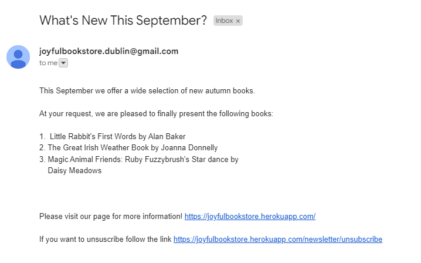

9. As a store owner I have created Facebook shop page to increase traffic on my website

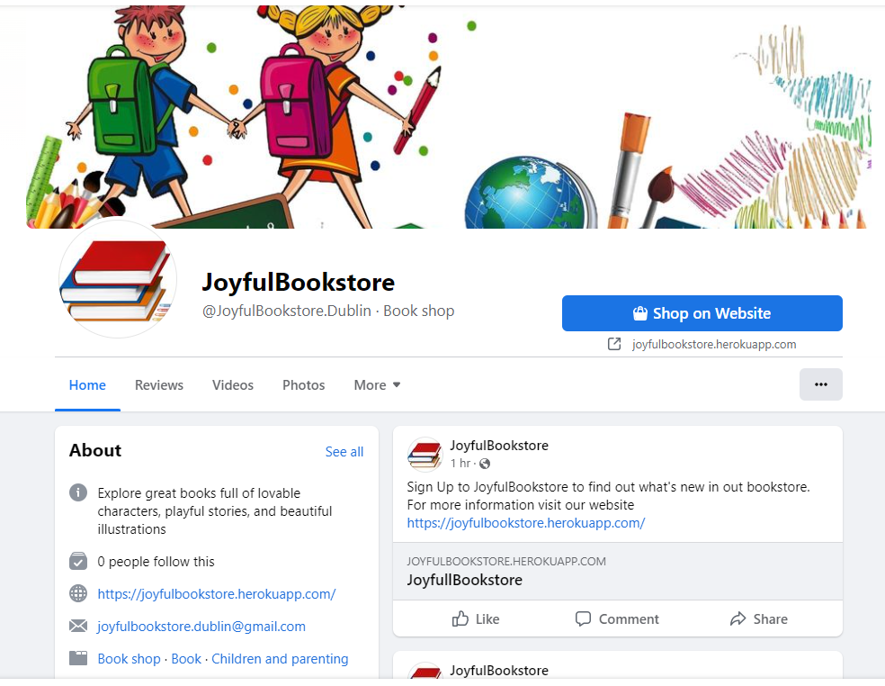

## EPIC: Navigation

10. As a user I can see an interesting home page so that I can understand what shop sells
    - The landing page has a short description that describes the purpose of the page so that the user can immediately see the purpose of the page

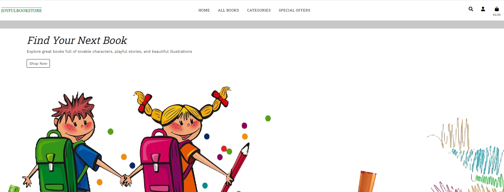

11. As a user I can easily navigate through the site so that I can view desired content
    - Navigation is located on each page so that the user can easily and simply navigate through the page and find all the necessary information

12. As a user I can easily find a navigation bar and footer so that I can see what content there is on the website
    - The navigation bar and the footer are on every page and provide the user with a quick link to the desired content
    

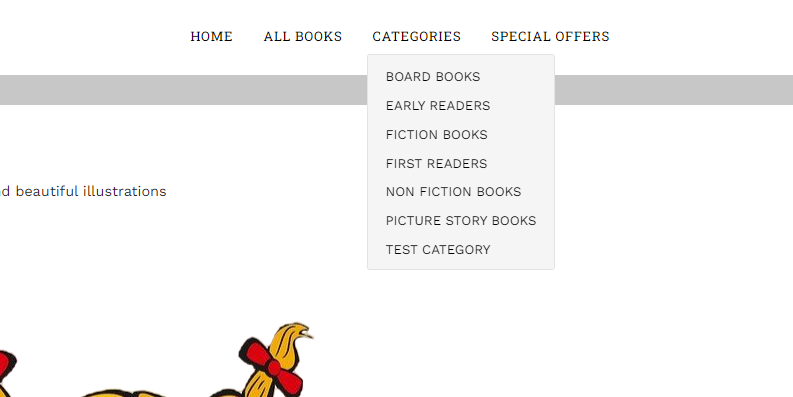

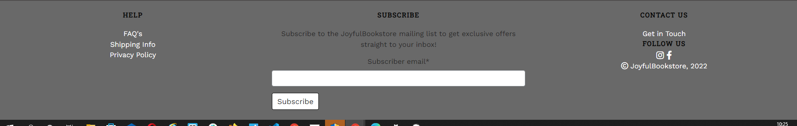

13. Aa a user I can easily see the products list so that I can see what the store has to offer
    - On the All books page, the user can see a list of all the books in the store and can sort them by price, title, category and rating.

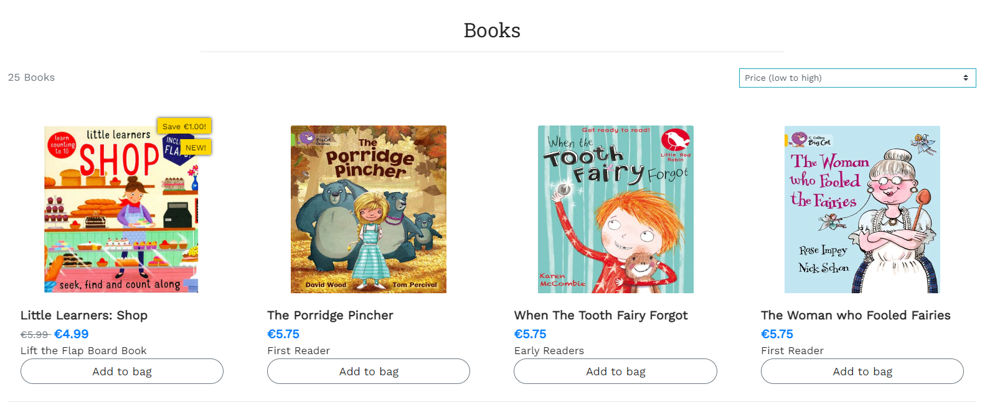

14. As a user I can search products by category so that I can easily find what I'm looking for
    - User can search books by category and easily sort books by desired book type

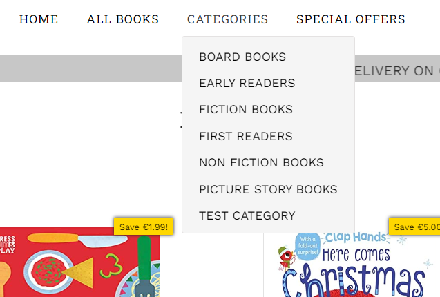

15. As a user I can sort products by rating, price and name so that I can easily find what I'm looking for
    - User can sort products by price,rating,title and category on All Books page

16. As a user I can search for products using the search form so that I can find the products I'm specifically looking for
    - User can use search bar to search for specific product, search form will perform a search in the author, title and description fields

 

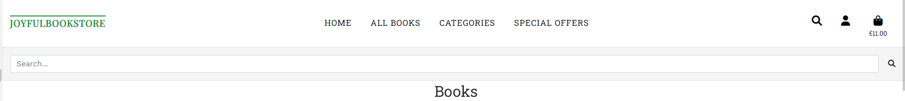

17. As a user I can see the book details page so that I can see the book name, rating, price, short description and comments
    - The user can see the book details and leave a review if they have an account

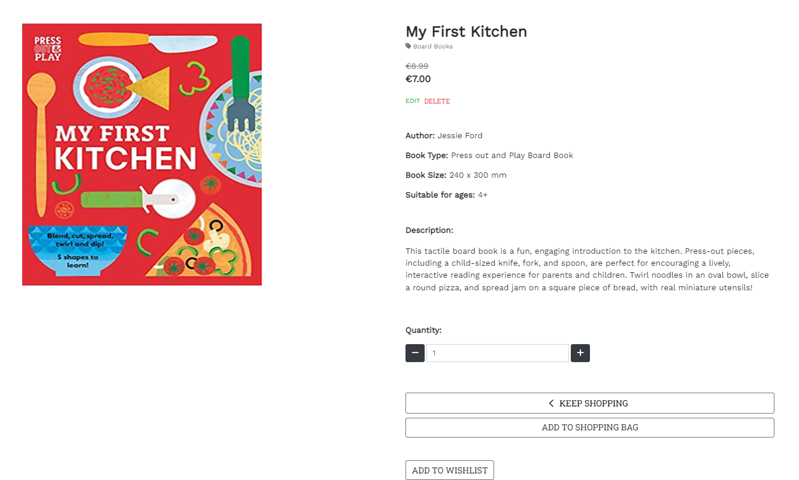

 

18. As a user I can read the FAQ's so that I can find the answer to my question or concern before contacting the bookstore
    - The user can read the FAQ's page before contacting the bookstore and check if his question has already been answered

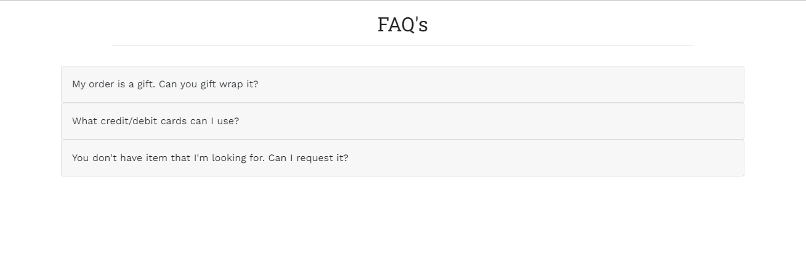

## EPIC: Purchase

19. As a user I can select the quantity of the desired product so that I can buy more product of the same kind
    - User can select quantity of the desired product on Book Detail page and on Shopping Bag page

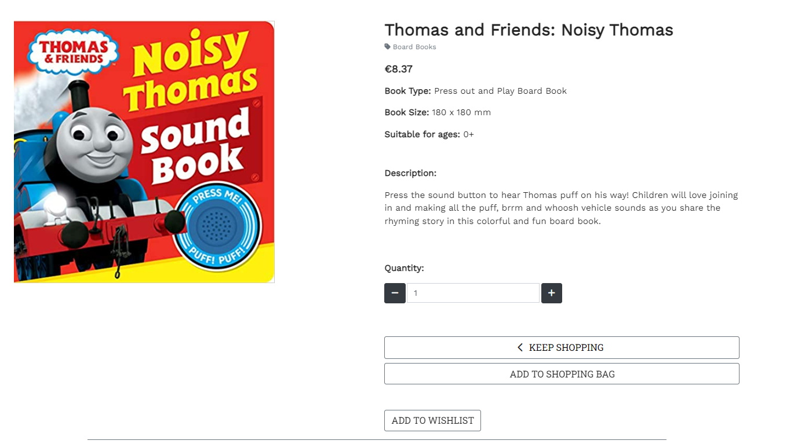

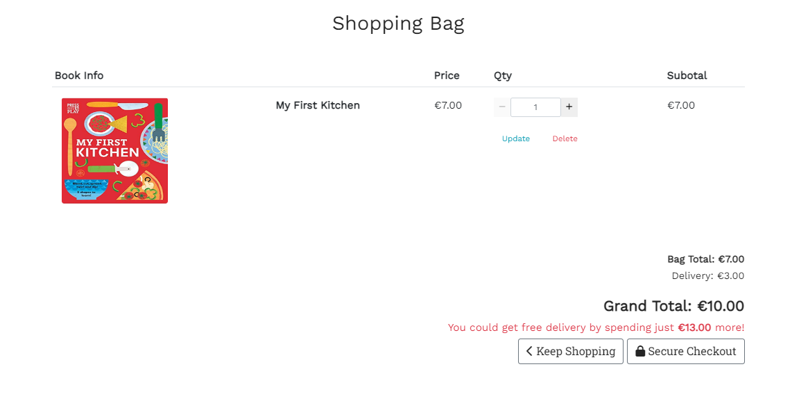

20. As a user I can add a selected book into the shopping bag so that I can keep track of what I am spending
    - User can add selected book into the shopping bag from All Books page and from Book Details Page

21. As a user I can see the shopping bag summary and total cost so that I can see how much I will spend
    - Shopping bas is located in navbar and user can always see shopping bag summary

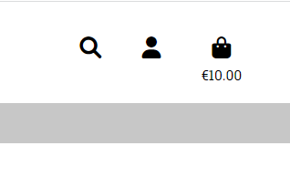

22. As a user I can remove items from shopping bag so that I don't buy what I don't want
    - User can remove the unwanted items from the shopping bag

23. As a user I can put in my card details so that I can pay for my goods
     - User can put in card details and delivery details so that they can make a purchase

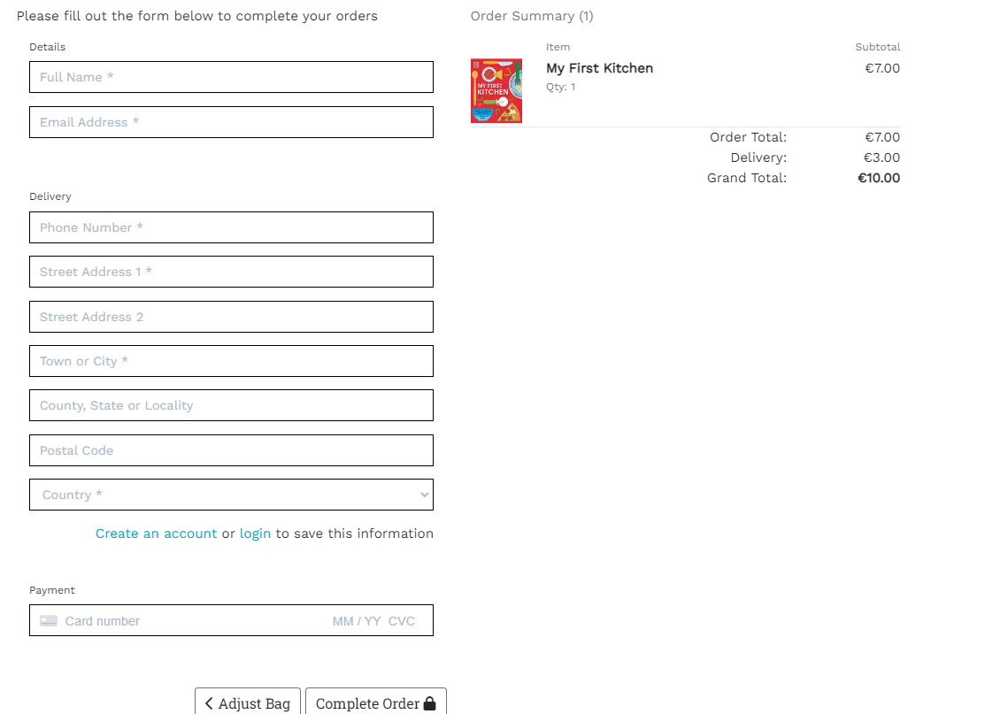

24. As a user I receive order confirmations so that I can be sure my order has been processed
    - After user submitted the purcase they can see order summary and confirmation

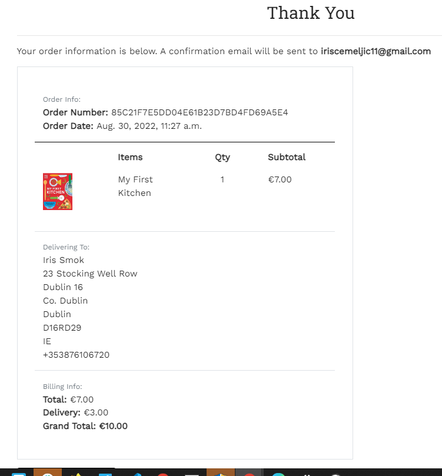

