[Validators](#validators)
* [Lighthouse](#lighthouse)
* [HTML](#html)
* [CSS](#css)
* [JSHINT](#jshint)
* [PEP8](#pep8)

[User Stories Testing](#user-stories-testing)

# Lighthouse 

# HTML

- All Pages were checked with the official [W3C validator](https://validator.w3.org/). 

## Home Page

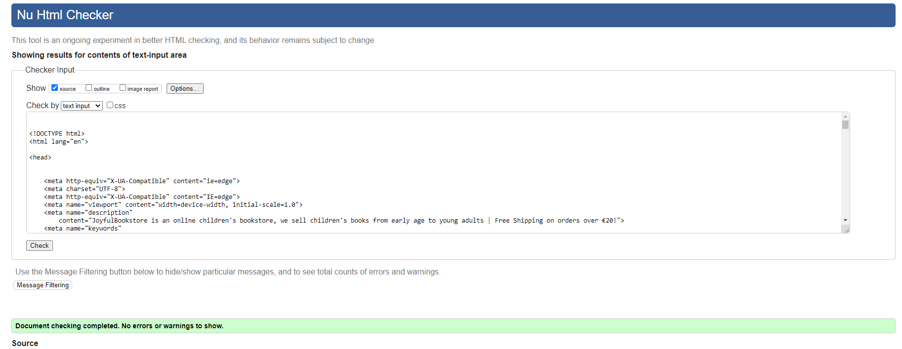

## All Books Page

## Book Detail

## Shopping Bag

Unsolved bug! 
Due to lack of time, it remained unresolved

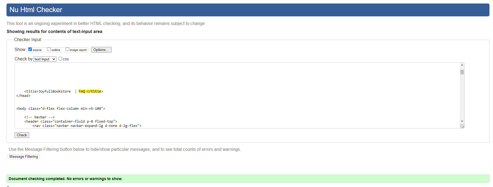

## Checkout Page

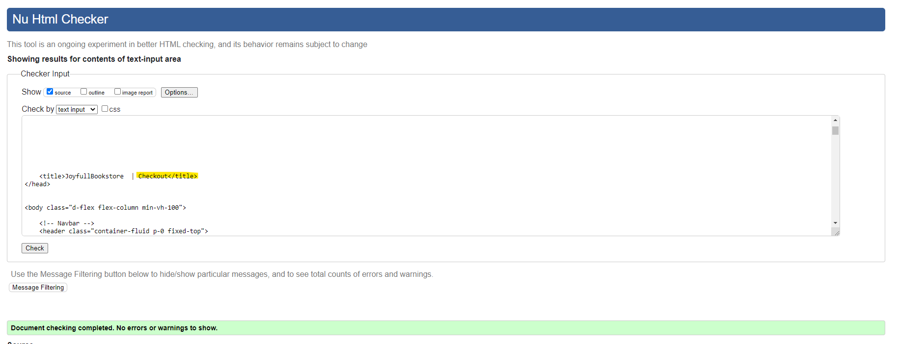

## User Account

### Personal Details

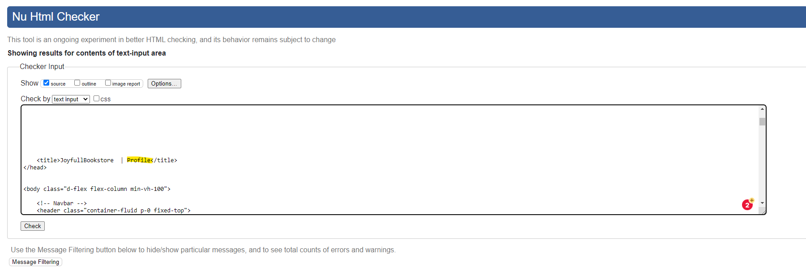

### Order History

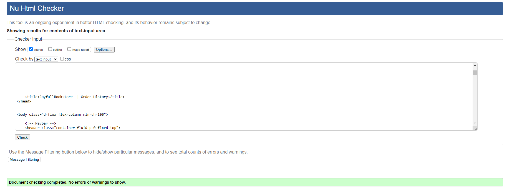

### Wishlist

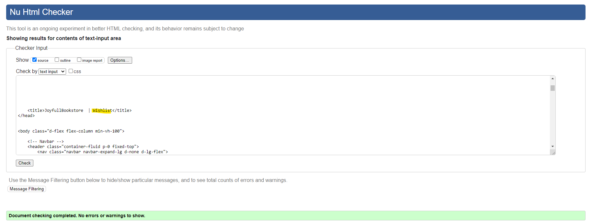

## Admin Account

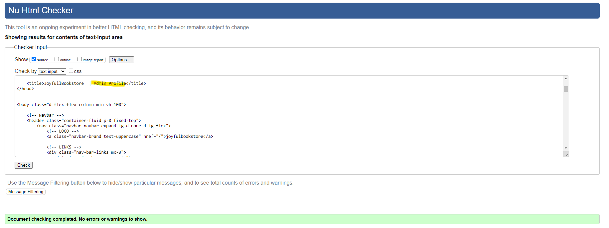

### Add Category 

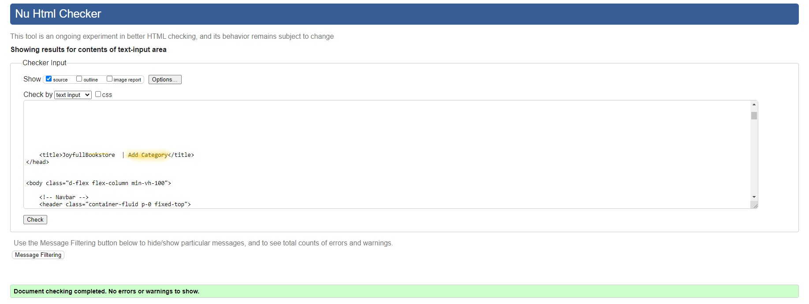

### Add Book

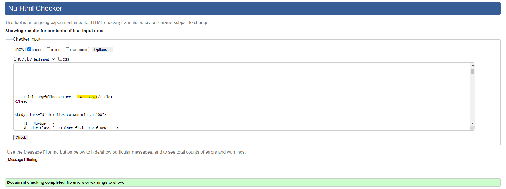

### Add FAQ's

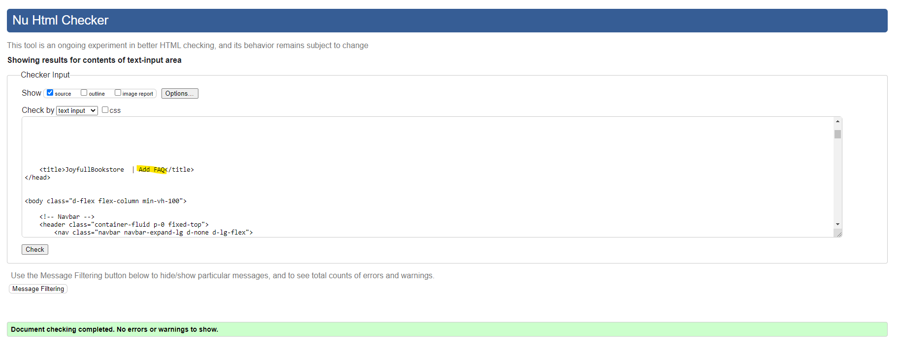

### Newsetter

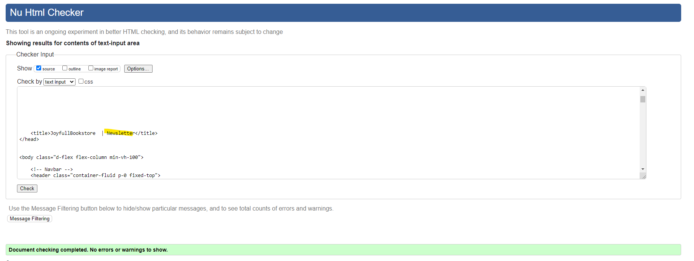

## Contact Page

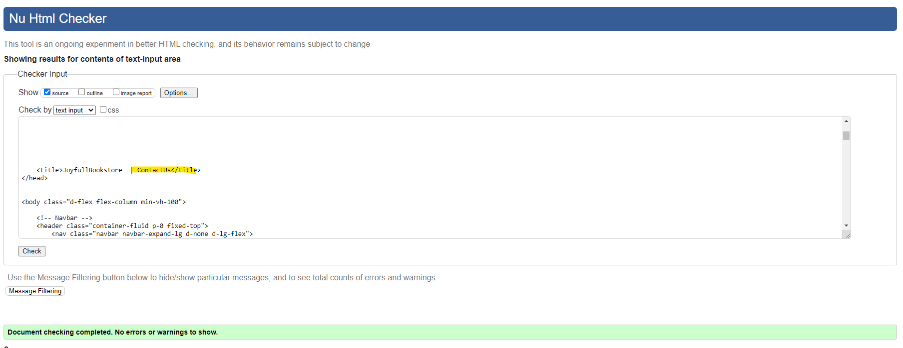

## FAQ's

# CSS

## Base.css

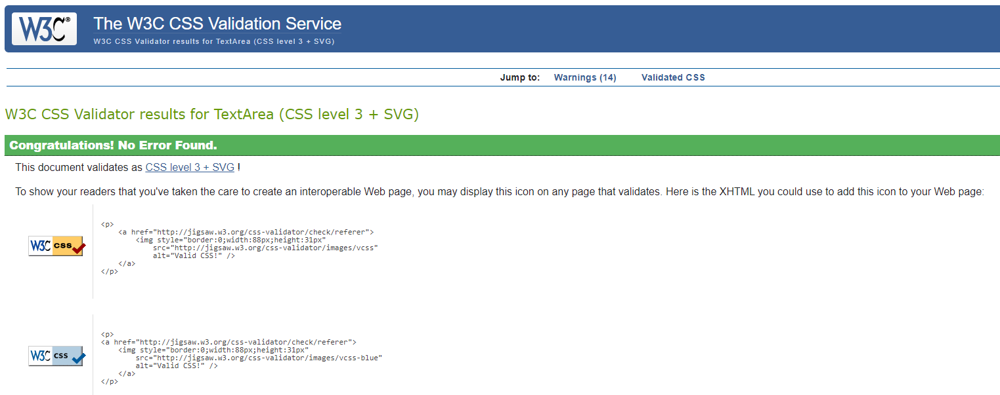

## Books.css

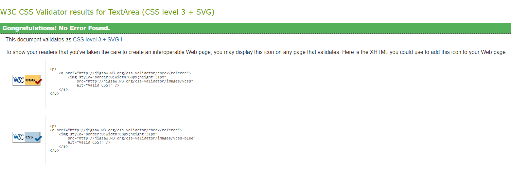

## Checkout.css

## Profiles.css

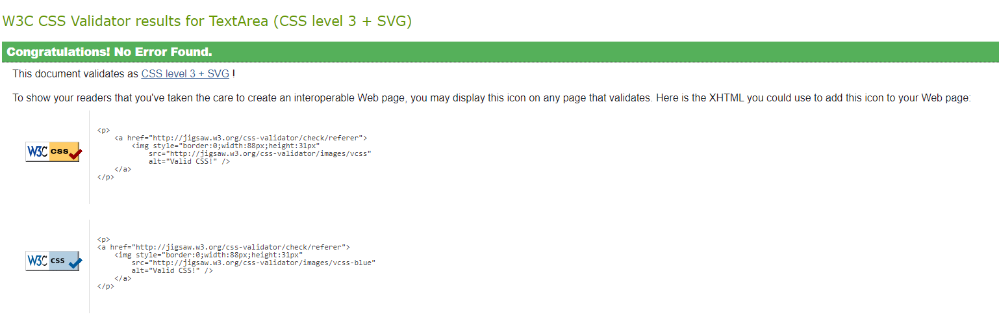

# JSHINT 
- All JS was passed through Jshint

## Base

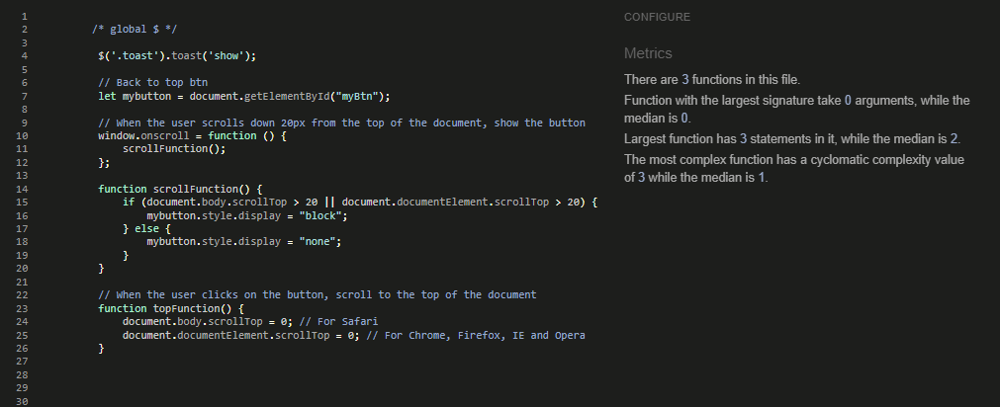

## Checkout 

## Shopping Bag quantity buttons

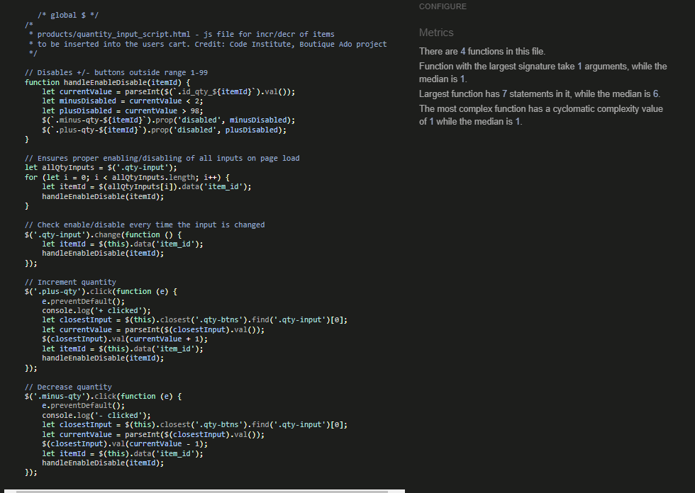

## Shopping Bag

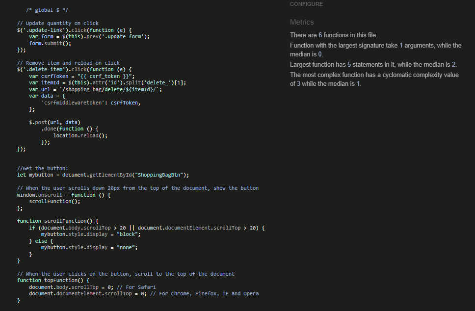

# User Stories Testing

## EPIC: Admin
1. As a store owner I can log in/out from of the admin panel so that I can connect or disconnect from the website
    -  Admin can login/out from admin panel and have full accedd to store backend

2. As a store owner I can add new product to the shop so that I can make sure the website is up to date
    - Store Owner can add products directly from Admin panel

3. As a store owner I can add new categories to the shop so that I can make sure the website is up to date
    - Store Owner can add categories directly from Admin panel

4. As a store owner I can add FAQ's to the site so that I can make sure that the user can find answer on the page before contacting the customer
    - Store Owner can add FAQ's directly from Admin panel

5. As a store owner I can edit/delete products so that I can make sure the website is up to date
    - Store Owner can edit/delete products from All Books page and Book Detail page

6. As a store owner I can edit/delete categories so that I can make sure the website is up to date
    - Store Owner can edit/delete categories directly from admin panel

7. As a store owner I can edit/delete FAQ's so that I can make sure the FAQ's are answered on correctly
    - Store Owner can edit/delete questions directly from the FAQ's page or from admin panel

8. As a store owner I can send out a newsletter via email so that I keep customers updated with new books
    - Store owner can send newsletter to all subscribers

9. As a store owner I have created Facebook shop page to increase traffic on my website

10. As a store owner I can read and respond to users questions send by contact form

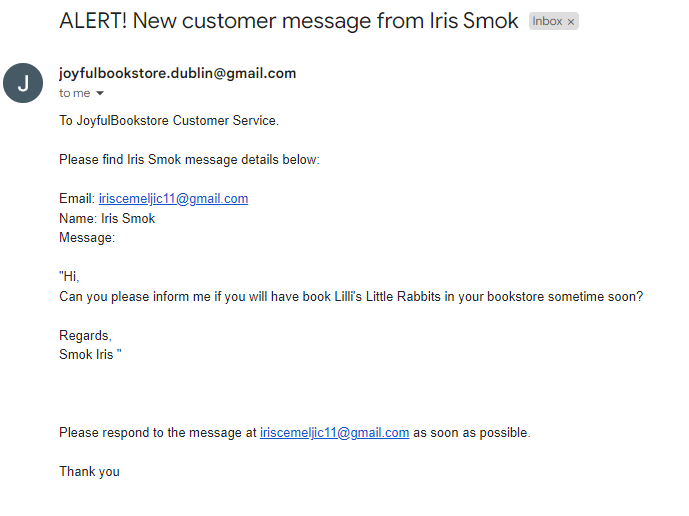

11. As a store owner I can unsubscribe subscribers from newsletter

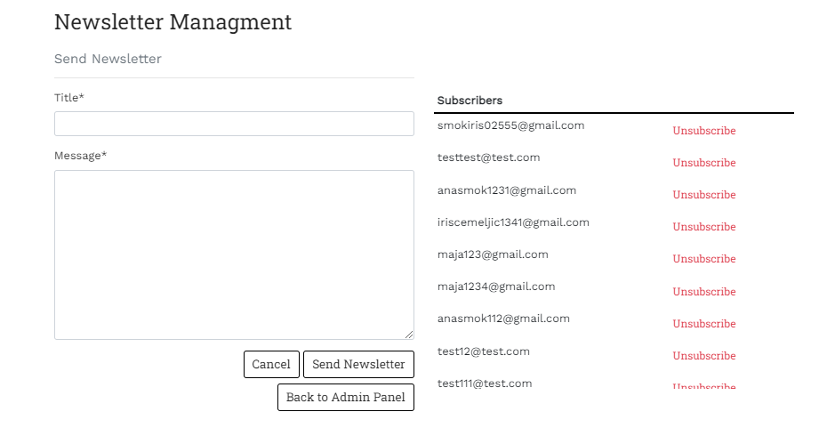

## EPIC: Navigation

12. As a user I can see an interesting home page so that I can understand what shop sells
    - The landing page has a short description that describes the purpose of the page so that the user can immediately see the purpose of the page

13. As a user I can easily navigate through the site so that I can view desired content
    - Navigation is located on each page so that the user can easily and simply navigate through the page and find all the necessary information

14. As a user I can easily find a navigation bar and footer so that I can see what content there is on the website
    - The navigation bar and the footer are on every page and provide the user with a quick link to the desired content
    

15. Aa a user I can easily see the products list so that I can see what the store has to offer
    - On the All books page, the user can see a list of all the books in the store and can sort them by price, title, category and rating.

16. As a user I can search products by category so that I can easily find what I'm looking for
    - User can search books by category and easily sort books by desired book type

17. As a user I can sort products by rating, price and name so that I can easily find what I'm looking for
    - User can sort products by price,rating,title and category on All Books page

18. As a user I can search for products using the search form so that I can find the products I'm specifically looking for
    - User can use search bar to search for specific product, search form will perform a search in the author, title and description fields

 

19. As a user I can see the book details page so that I can see the book name, rating, price, short description and comments
    - The user can see the book details and leave a review if they have an account

 

20. As a user I can read the FAQ's so that I can find the answer to my question or concern before contacting the bookstore
    - The user can read the FAQ's page before contacting the bookstore and check if his question has already been answered

## EPIC: Purchase

21. As a user I can select the quantity of the desired product so that I can buy more product of the same kind
    - User can select quantity of the desired product on Book Detail page and on Shopping Bag page

22. As a user I can add a selected book into the shopping bag so that I can keep track of what I am spending
    - User can add selected book into the shopping bag from All Books page and from Book Details Page

23. As a user I can see the shopping bag summary and total cost so that I can see how much I will spend
    - Shopping bas is located in navbar and user can always see shopping bag summary

24. As a user I can remove items from shopping bag so that I don't buy what I don't want
    - User can remove the unwanted items from the shopping bag

25. As a user I can put in my card details so that I can pay for my goods
     - User can put in card details and delivery details so that they can make a purchase

26. As a user I receive order confirmations so that I can be sure my order has been processed
    - After user submitted the purcase they can see order summary and confirmation

## EPIC: User Interaction

27. As a user I can see rating and reviews so that I can read the opinions of other users

 

 

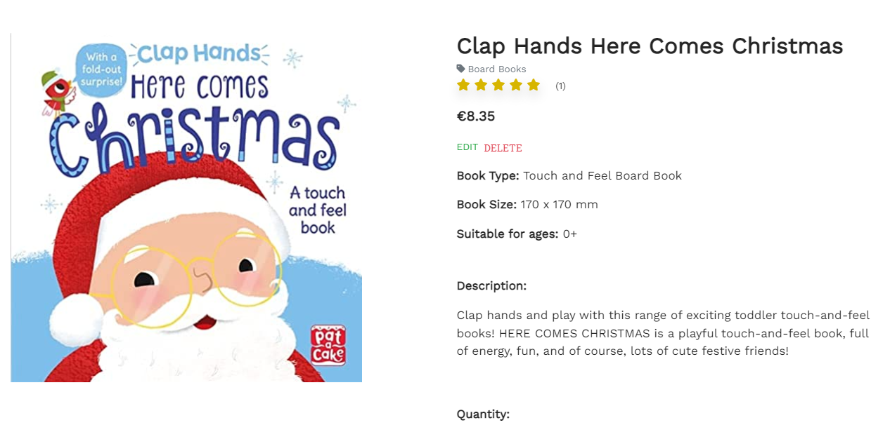

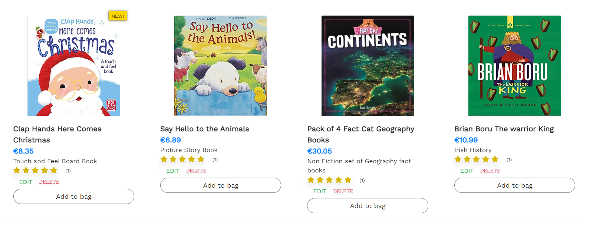

28. As a user I am notified about any changes I have made so that I have a clear understanding of what has been completed/updated
    -  Toast messages inform the user of their status and any change the user makes

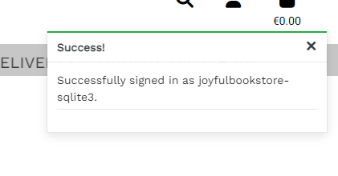

29. As a user I can connect to the social media sites so that I can follow them and keep up to date with their products and promotions
    - Social media link are located in the footer of every page so user can easily connect

30. As a user I can sign up for the website's newsletter so that I can keep up to date with new products and promotions
    - Footer containes a link for User to subscribe to bookstore newsletter, once subscribe user will receive email confirmation  

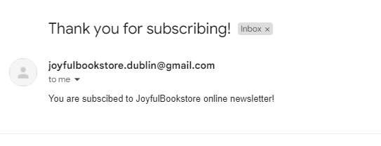

31. As a user I can unsubscribe from newsletter if I don't want to receive stors newsletters
    - In every email user can find address to unsubscribe

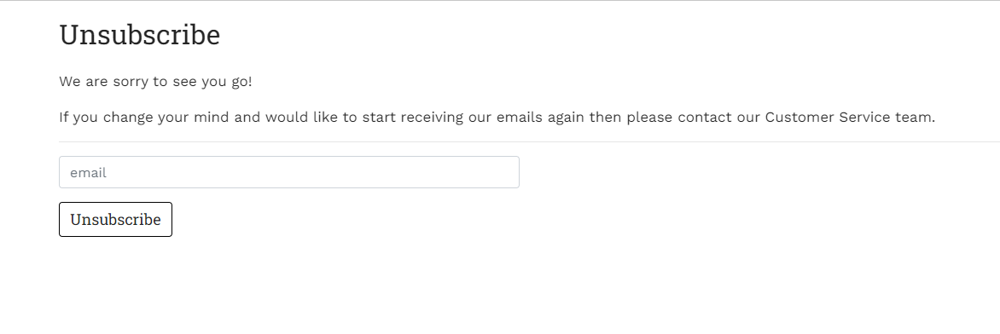

32. As a user I can contact the bookstore so that I can find out any information that I require

33. As a user I can receive a contact confirmation email to let me know that my email has been sent

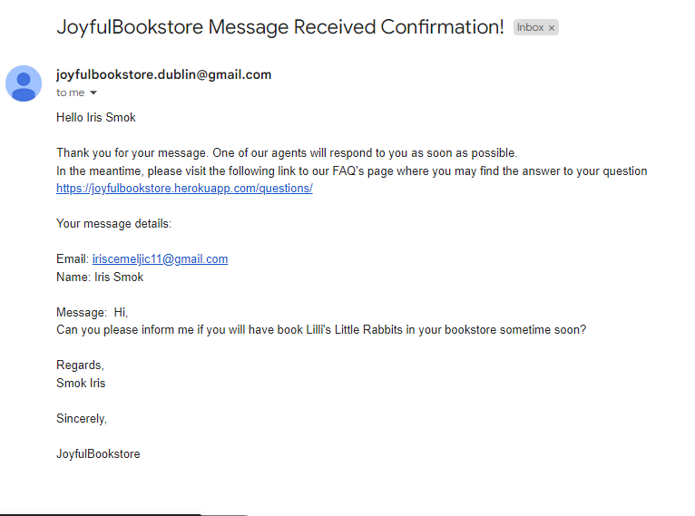

34. As a logged-in User I can leave reating and reviews so that I can share my experience with others

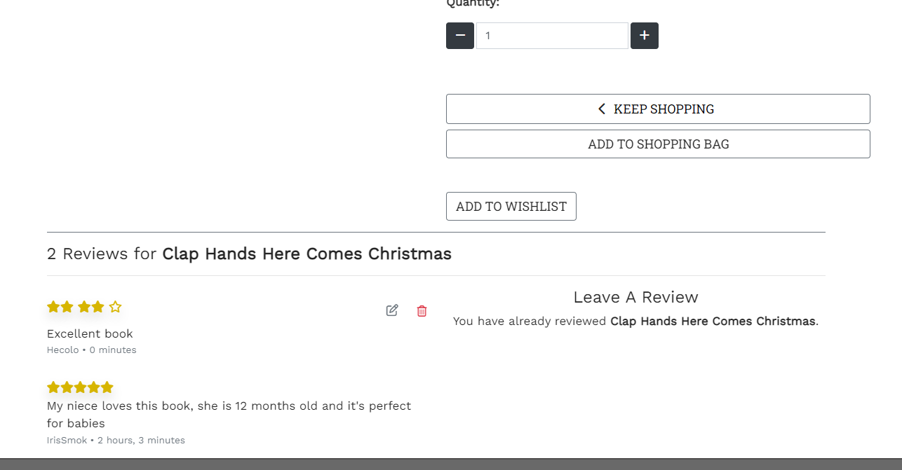

35. As a logged-in User I can save selected products to my whishlist for later purchase
    - Logged-in User can save and remove products to wishlist. 
    - For Users that don't have an account and try to use "add to wishlist" button a pop window will tell users to open an account to uset this feature 

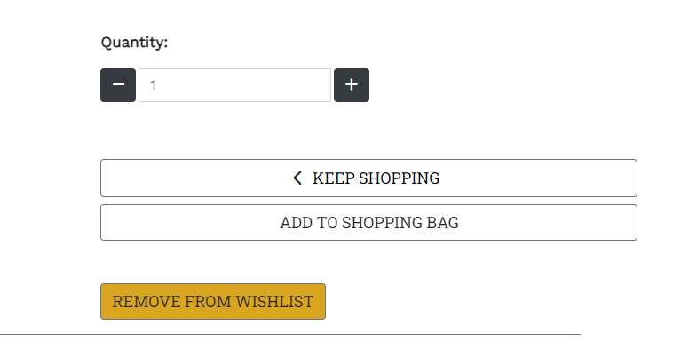

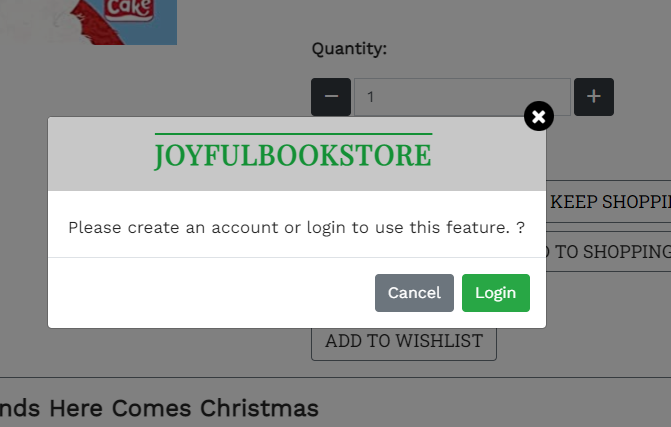

## EPIC: Accounts

36. As a user I can easily see if I'm logged-in or logged-out so that I can be sure what my status is
    - User can easily see they account status, when the user is logged in they will see My Account link

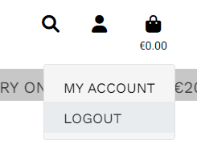

37. As a user I can log in/out off my account if I wish so that I can connect or disconnect from the website

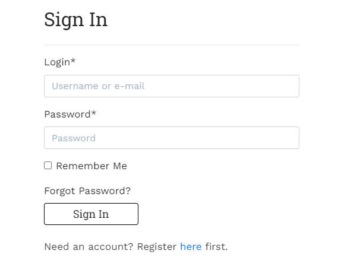

38. As a user I can register for an account so that I can use features for logged-in users

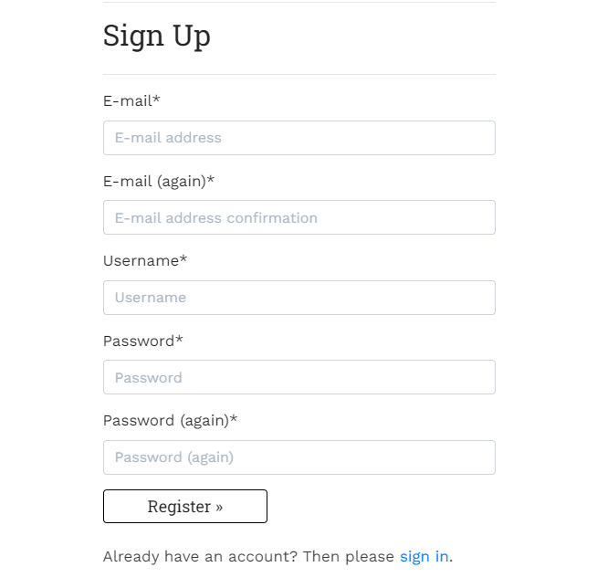

39. As a user I can receive a confirmation email when creating an account so that I know the registration was successful

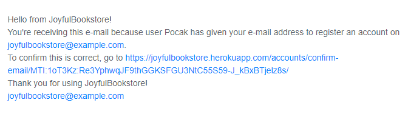

40. As a logged-in User I can have my details saved so that I don't have to retype my address every time

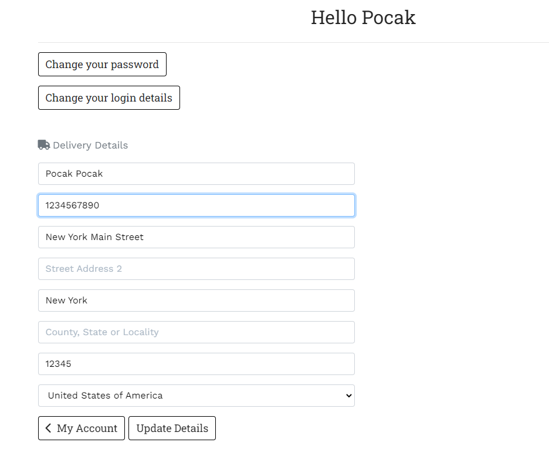

