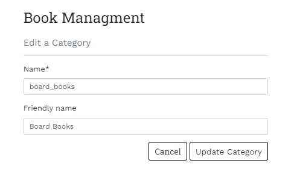
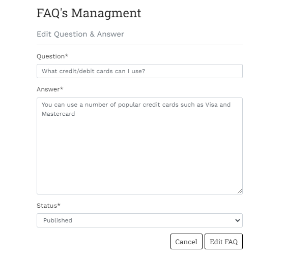
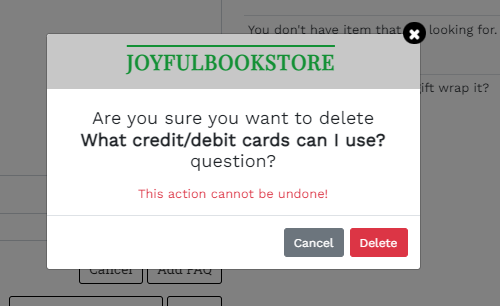

# Validators

## HTML

- All Pages were checked with the official [W3C validator](https://validator.w3.org/). 

## Lighthouse 

## Home Page

## All Books Page

## Book Detail

## Shopping Bag

Unsolved bug! 
Due to lack of time, it remained unresolved

## Checkout Page

## User Account

## Admin Account

## Contat Page

# User Stories Testing

## Epic Admin
1. As a store owner I can log in/out from of the admin panel so that I can connect or disconnect from the website
- Admin can login and log out from admin panel and have full accedd to store backend

2. As a store owner I can add new product to the shop so that I can make sure the website is up to date
    Store Owner can add products directly from Admin panel

3. As a store owner I can add new categories to the shop so that I can make sure the website is up to date
    Store Owner can add categories directly from Admin panel

4. As a store owner I can add FAQ's to the site so that I can make sure that the user can find answer on the page before contacting the customer
    Store Owner can add FAQ's directly from Admin panel

5. As a store owner I can edit/delete products so that I can make sure the website is up to date
    Store Owner can edit/delete products directly from Admin panel or from All Books page and Book Detail page

6. As a store owner I can edit/delete categories so that I can make sure the website is up to date
    Store Owner can edit/delete categories directly from admin panel

7. As a store owner I can edit/delete FAQ's so that I can make sure the FAQ's are answered on correctly
    Store Owner can edit/delete questions directly from the FAQ's page or from admin panel

8. As a store owner I can send out a newsletter via email so that I keep customers updated with new books
    Store owner can send newsletter to all subscribers

9. As a store owner I have created Facebook shop page to increase traffic on my website

